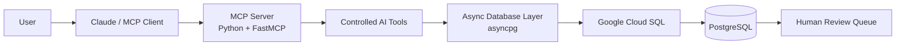
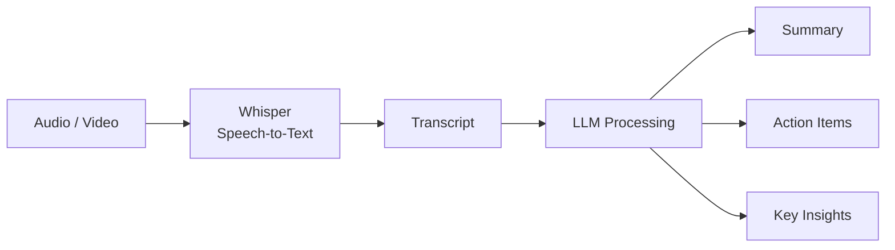
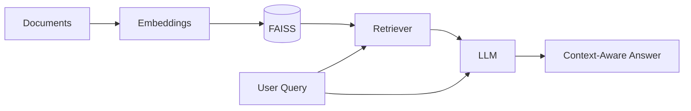

# 👋 Hi, I'm Varsha Hindupur

### Generative AI | AI Systems | Cloud & Backend Engineering

I build **production-oriented AI systems** that connect Large Language Models, enterprise data, APIs, cloud infrastructure, and software applications.

My work spans **Generative AI, RAG, AI agents, Model Context Protocol (MCP), embeddings, LLM orchestration, ML deployment, backend engineering, and cloud-native architecture**.

I bring a strong software-engineering foundation to AI development — designing not only models and prompts, but also the **APIs, data pipelines, retrieval systems, cloud infrastructure, integrations, and deployment workflows required to run AI applications reliably at scale**.

🎓 M.S. Information Systems — Northeastern University  
🏅 AWS Certified Solutions Architect | Microsoft Azure Fundamentals  
💼 5+ years across Software Engineering, Cloud, Data, and AI systems  
🤖 Building LLM, RAG, Agentic AI, MCP, and ML applications  
☁️ Experience designing and deploying distributed systems across AWS, GCP, containers, and Kubernetes  
🔬 Published researcher with experience applying AI/ML to research and real-world applications

---

# 🧠 AI Engineering Focus

My current engineering focus includes:

- **LLM Application Engineering**
- **Retrieval-Augmented Generation (RAG)**
- **AI Agents and Tool-Calling Systems**
- **Model Context Protocol (MCP)**
- **Vector Search and Embedding Optimization**
- **LLM Orchestration**
- **Prompt Engineering**
- **Enterprise AI Integration**
- **Machine Learning Deployment**
- **AI APIs and Backend Services**
- **Cloud-Native AI Infrastructure**
- **Data and AI Pipelines**
- **Evaluation and Observability**
- **Scalable Distributed Systems**

I am especially interested in building AI systems where an LLM can move beyond text generation and securely interact with **databases, APIs, enterprise applications, search systems, and business workflows**.

---

# 🛠️ Technical Stack

### 🤖 Generative AI & AI Engineering

`LLMs` • `RAG` • `AI Agents` • `MCP` • `LangChain` • `Hugging Face` • `ChromaDB` • `FAISS` • `Prompt Engineering` • `Embedding Models` • `Vector Search` • `Llama` • `Groq` • `Ollama` • `Amazon Bedrock`

### 🧠 Machine Learning

`Python` • `PyTorch` • `TensorFlow` • `Transformers` • `Scikit-learn` • `MLflow` • `LSTM` • `NLP` • `Anomaly Detection` • `Model Evaluation`

### ⚙️ Backend & APIs

`Python` • `FastAPI` • `Flask` • `Django` • `Java` • `Spring Boot` • `Node.js` • `Express.js` • `REST APIs` • `GraphQL`

### ☁️ Cloud & AI Infrastructure

`AWS` • `GCP` • `Amazon Bedrock` • `SageMaker` • `Lambda` • `API Gateway` • `EKS` • `EC2` • `S3` • `CloudFront` • `Google Cloud SQL` • `GKE`

### 📦 DevOps / MLOps

`Docker` • `Kubernetes` • `Terraform` • `Helm` • `Jenkins` • `GitHub Actions` • `MLflow` • `CI/CD`

### 🗄️ Data

`PostgreSQL` • `MongoDB` • `DynamoDB` • `Redis` • `Snowflake` • `SQLAlchemy` • `Vector Databases`

---

# 🚀 Featured AI Engineering Projects

## 🔌 Fraud Transaction Review — MCP Server

**Model Context Protocol | Python | Claude | PostgreSQL | Google Cloud SQL | asyncpg**

Built an MCP server that allows an AI assistant to interact with a transaction database through controlled tools rather than unrestricted database access.

The server exposes tools that allow an AI client to:

- Retrieve individual transactions
- Identify transactions already classified as fraudulent
- Submit suspicious transactions to a human-review queue
- Interact with PostgreSQL using parameterized queries
- Connect securely to a database hosted in Google Cloud SQL

### Architecture



This project demonstrates a pattern increasingly important in enterprise AI:

> **LLM → Tool → Application Logic → Enterprise Data**

Rather than giving the LLM direct database access, MCP provides a controlled interface through explicitly defined tools.

**Repository:**  
[Fraud Transaction Review MCP Server](https://github.com/varshahindupur09/Fraud_Transaction_Review_MCP_Server)

---

## 🧠 Domain-Specific Vector Embedding Optimization

**Hugging Face | RAG | Llama 3 | Groq | ChromaDB | Contrastive Learning**

Fine-tuned and evaluated embedding models using domain-specific synthetic cryptocurrency data.

Built a pipeline involving:

- Domain-specific dataset generation
- RAG-assisted synthetic dataset creation
- Contrastive learning
- Embedding model evaluation
- Vector storage and retrieval
- LLM-assisted retrieval workflows

Worked with embedding architectures including:

- `all-MiniLM-L12-v2`
- `mxbai-embed-large`

The project focuses on improving semantic retrieval for specialized domains instead of relying only on general-purpose embeddings.

---

## Research Professor Kelly's Supporting Website

Architecture Diagram for Chatbot: [https://github.com/varshahindupur09/RA_Online_Instrument_Architecture/blob/main/README_Chatbot.md]! Click Here
Architecture Diagram for Website: [https://github.com/varshahindupur09/RA_Online_Instrument_Architecture/blob/main/Untitled%20Diagram.drawio]! Click Here 

---

## 🤝 Meeting Intelligence — GenAI Summarization Pipeline

**LLMs | Whisper | LangChain | GPT | Streamlit**

Built an LLM-powered meeting-intelligence system that converts audio/video conversations into structured information.

Pipeline:



Focused on transforming unstructured conversations into usable summaries, decisions, and action items.

---

## 🏥 Patient Triage — RAG-Based AI System

**RAG | Groq | ChromaDB | LLMs**

Developed an AI-assisted patient-triage application using Retrieval-Augmented Generation.

The application combines:

- Domain knowledge retrieval
- Vector search
- LLM reasoning
- Context-aware response generation

to assist with prioritization based on provided patient information.

The project demonstrates how RAG can constrain AI responses using retrieved domain context rather than relying entirely on model knowledge.

---

## 🎥 Movie Mania — RAG Chatbot

**LangChain | FAISS | Vertex AI | RAG**

Built a context-aware conversational application using Retrieval-Augmented Generation.

Architecture:



The project demonstrates document ingestion, embedding generation, vector indexing, semantic retrieval, and LLM response generation.

---

# 🏗️ AI + Large-Scale Cloud Architecture

## 📊 Research Online Instrument & Conversational Feedback Platform

**AWS | React | Node.js | Amazon Lex | API Gateway | EC2 | CloudFront | S3 | MongoDB**

Designed architecture for an online research instrument initially planned for approximately **10,000 users**, with the participant population later expanding to **2M+ users**.

The system included:

- Amazon Route 53
- Amazon CloudFront
- Amazon S3
- React
- Amazon API Gateway
- Node.js / Express
- Docker
- Elastic Beanstalk
- EC2 Auto Scaling
- Load Balancing
- MongoDB
- Research data pipelines

I also designed a conversational user-feedback capability using **Amazon Lex**, allowing feedback to be collected through natural-language interactions at large scale.

### Architecture



```mermaid
flowchart LR

    USER[Research Participant]

    R53[Route 53]

    CF[CloudFront]

    FRONTEND[React<br/>Amazon S3]

    LEX[Amazon Lex<br/>Feedback Chatbot]

    API[API Gateway]

    BACKEND[Node.js / Express<br/>Backend Services]

    SCALE[EC2 Auto Scaling<br/>Load Balancer]

    DB[(MongoDB)]

    PIPE[Research Data Pipeline]

    ANALYTICS[Research Analysis]

    USER --> R53
    R53 --> CF
    CF --> FRONTEND

    FRONTEND --> LEX
    FRONTEND --> API

    LEX --> API

    API --> SCALE
    SCALE --> BACKEND

    BACKEND --> DB
    DB --> PIPE
    PIPE --> ANALYTICS
```

This project reflects my broader approach to AI engineering: **AI is one component of a larger production system**, and scalability, APIs, data architecture, reliability, and cloud infrastructure matter just as much as the model itself.

**Repository:**  
[RA Online Instrument Architecture](https://github.com/varshahindupur09/RA_Online_Instrument_Architecture)

---

# ☁️ ML Platform Engineering

## 💲 ML Model Deployment on Amazon EKS

**Machine Learning | Kubernetes | EKS | Helm | Terraform | APIs**

Designed a cloud-native deployment architecture for serving a machine-learning model on Kubernetes.

The project includes:

- Infrastructure provisioning with Terraform
- Amazon EKS
- Kubernetes
- Helm deployments
- API-based model access
- VPC networking
- Containerized ML workloads

This project demonstrates the infrastructure side of AI engineering — taking a model from development into a repeatable cloud deployment.

---

# 🔐 AI Anomaly Detection

## Sensitive Data Shield

**Transformers | NLP | GKE | Grafana**

Built an AI-based sensitive-data detection system using transformer models.

The system uses:

`TFAutoModelForTokenClassification`

to identify sensitive information and integrates model inference with containerized deployment and monitoring infrastructure.

Key areas:

- NLP inference
- Sensitive entity detection
- Containerization
- Kubernetes deployment
- Monitoring
- AI service architecture

---

# 🌦️ ML + Data Engineering

## AirCast — Air Quality Prediction

Developed an LSTM-based forecasting platform with data processing pipelines, model inference, and a React-based interface.

## Weather Explorer

Built a weather analytics platform for processing large environmental datasets including SEVIR, GOES, and NEXRAD data.

The project combines:

- Data engineering
- ETL
- Airflow
- Large datasets
- Analytics
- Visualization

---

# 🧩 How I Approach AI Engineering

I view production AI as a complete engineering system:

```text
Data
  ↓
Data Pipelines
  ↓
Embeddings / ML Models
  ↓
Retrieval / Context
  ↓
LLM / AI Agent
  ↓
Tools & APIs
  ↓
Backend Services
  ↓
Cloud Infrastructure
  ↓
Monitoring & Evaluation
  ↓
User / Business Workflow
```

My background across software engineering, distributed systems, cloud infrastructure, and machine learning allows me to work across this entire lifecycle rather than treating the LLM as an isolated component.

---

# 🎯 Current Areas of Exploration

I am currently focused on:

- Agentic AI architectures
- Model Context Protocol (MCP)
- AI tool calling
- Enterprise AI agents
- RAG evaluation
- Hybrid retrieval
- Embedding optimization
- LLM orchestration
- AI observability
- Guardrails and human-in-the-loop AI systems
- Production GenAI architecture

---

# 📚 Engineering & Research

Alongside production engineering, I maintain projects involving:

- Distributed systems
- System design
- Machine learning
- Cloud architecture
- High-performance computing
- Algorithms
- NLP
- Data engineering

This combination of research and production engineering helps me approach AI systems from both an **experimental** and an **engineering** perspective.
